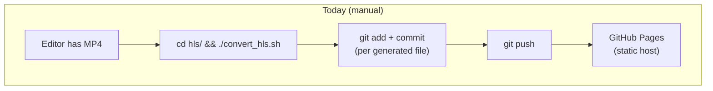
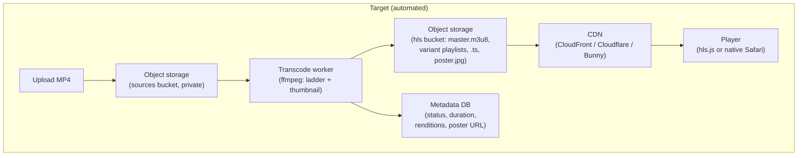

<!-- title: MP4 → HLS Migration Review -->
# MP4 → HLS Migration: Technical Review & Implementation Plan

> **Status: historical record.** This document captures the state of the repository *as originally audited*, before the migration it recommends was executed. It is kept as-is (rather than edited to match current state) because it's the design rationale the eventual fixes were built from. **For current repository state, see `README.md`.** Since this was written:
> - All examples of the segment-duration bug (`hls/fin3/v0/...` etc.) were fixed — every active video now uses forced 6-second keyframe-aligned segments, verified via `scripts/validate_hls.sh`.
> - The two "script eras" (`seg000.ts` vs `segment_000.ts`, `CODECS` vs `NAME`) were unified — every active video now uses `scripts/convert_hls.sh` consistently.
> - `frnkvll`, `jewely-v1`, `jihad-v1`, and `watch-v1` (referenced below as examples) were subsequently retired by the repository owner and no longer exist in `hls/`.
> - The hardcoded `CODECS` value discussed in §5/§14 is no longer hardcoded — it's now derived per rendition from the actual encoded output (see `scripts/convert_hls.sh` and README).

Repository reviewed: `video-v2` — the shared media backend for the **Franc Vila** and **Badreya** web platforms, currently hosted as a static tree on GitHub Pages (`https://simaa99.github.io/video-v2/`).

## 0. What's actually in this repo today

Before designing anything, here is what inspection turned up — this drives every recommendation below.

- **No application code.** There is no upload endpoint, no backend, no database. The "system" is: a person drops an `.mp4` in a folder, runs a bash script by hand, then `git add / commit / push`. GitHub Pages serves the resulting static files.
- **Two different script eras produced inconsistent output.** `hls/ring/v0/` uses `seg000.ts` naming; `hls/frnkvll/v0/` uses `segment_000.ts`; some master playlists include `CODECS`, others include `NAME` instead; some use `v0`/`v1` (unlabeled), others don't. There is no single source of truth for "how a video gets encoded."
- **Segment durations are broken.** `hls/fin3/v0/index.m3u8` has segments ranging from **2.9s to 10.8s** against a declared 8s target. This happens because the old script never forced keyframes at segment boundaries — libx264 placed them wherever the encoder's scene-change heuristic decided. Uneven segments hurt ABR switching, seeking, and CDN cache efficiency.
- **Stray, unconverted files.** `hls/jewely-home.mp4`, `hls/Fv_Black Big_low.mp4`, and `hls/2026-04-27 12.19.14.mp4` were sitting loose directly inside `hls/` (confirmed by directly listing the folder) — accidental uploads that were never cleaned up, in a directory that's supposed to serve HLS only.
- **Git history is one commit per generated file.** `git log` shows hundreds of individual commits like `feat: add seg003.ts for HLS streaming support` — every `.ts` segment and every `.m3u8` file was committed separately. This is what happens when there's no automation: a human (or a tool acting like one) stages and commits each output file.
- **Six of the ten raw source files exceed GitHub's hard 100MB per-file limit** (`fin3.mp4` = 647MB, `frnkvll.mp4` = 620MB, `don-blue.mp4` = 275MB, `don-blue-white.mp4` = 245MB, `reloj-naranja-FVGB-orange.mp4` = 230MB, `Reloj-azul-y-negro-FVGB.mp4` = 156MB). These **cannot be committed to plain git at all** — a `git push` including them would be rejected outright. This alone rules out "just commit everything" as a strategy going forward.
- **The working tree is already 2.8GB** and growing with every new video, on a hosting product (GitHub Pages) whose own documentation asks that repos stay under ~1GB and recommends against using it to host or stream large media.

Given all this, the review below has two tracks:
1. **Fixes applied directly in this repo now** (concrete files, tested) — bring today's manual process up to a correct, consistent baseline.
2. **The target production architecture** for when video count grows past what git+GitHub Pages can support — this is a genuine architecture change, not a config tweak, and is flagged clearly as such.

---

## 1–3. Current architecture, asset lifecycle, and target design





The only thing that should ever reach the browser is `master.m3u8` (and the segments/playlists it references). MP4 stays a build input, never a runtime artifact.

---

## 4. What should happen automatically after an MP4 upload

A production pipeline should do this without a human touching anything:

1. **Validate** the upload (container/codec sanity via `ffprobe`; reject corrupt files early).
2. **Probe** source resolution, frame rate, duration, rotation metadata.
3. **Transcode** to a bitrate ladder (§14–15), skipping rungs that would upscale.
4. **Segment** into 6s `.ts` chunks with forced keyframe alignment (§0's segment-duration bug, now fixed).
5. **Generate a poster thumbnail** (§16).
6. **Write `master.m3u8`** referencing only the renditions actually produced.
7. **Upload outputs** to storage/CDN origin; **never** the raw MP4.
8. **Record metadata** (slug, duration, available renditions, poster path, status = ready) so the frontend can query "is this video ready?" instead of guessing.
9. **Invalidate/short-cache** the playlist paths so a re-encode of the same slug propagates quickly (§11).
10. **Clean up** the transcode worker's local temp files; archive or discard the raw source per retention policy (§17).

Today, only step 3–6 exist, and only when a human remembers to run the script and commit every output file. That gap is exactly what `.github/workflows/transcode.yml` (added in this change, see §6) partially closes as a stopgap, and what a real queue-based worker closes properly at scale (§18).

---

## 5. Recommended FFmpeg commands

The rewritten `scripts/convert_hls.sh` (see §6) encodes this ladder per rung:

```bash
ffmpeg -y -i "$INPUT" \
  -vf "scale=trunc(oh*a/2)*2:${HEIGHT}" \
  -c:v libx264 -profile:v high -crf 20 -preset fast \
  -b:v "$VIDEO_BITRATE" -maxrate "$MAXRATE" -bufsize "$BUFSIZE" \
  -g "$GOP" -keyint_min "$GOP" -sc_threshold 0 \
  -force_key_frames "expr:gte(t,n_forced*6)" \
  -c:a aac -b:a "$AUDIO_BITRATE" -ac 2 \
  -hls_time 6 -hls_playlist_type vod \
  -hls_flags independent_segments \
  -hls_segment_filename "$OUT/segment_%03d.ts" \
  "$OUT/index.m3u8"
```

Why each flag matters:

| Flag | Why |
|---|---|
| `scale=trunc(oh*a/2)*2:H` | Preserves aspect ratio, forces even dimensions (H.264 requires even width/height). |
| `-crf 20 -b:v -maxrate -bufsize` | **Capped CRF**: quality-driven encoding (CRF) with a hard bandwidth ceiling. Plain CRF (what the old script used) gives no predictable bitrate, which ABR heuristics rely on to decide when to switch renditions. |
| `-g / -keyint_min / -sc_threshold 0 / -force_key_frames` | Forces a keyframe every exactly 6s and disables scene-cut-triggered keyframes. This is the fix for the 2–14s segment bug found in `hls/fin3/v0/index.m3u8` — without it, every rendition can cut at different timestamps, which breaks clean mid-playback ABR switches. |
| `-hls_time 6` | 6s is Apple's current HLS Authoring Guidelines recommendation for VOD (down from the historic 10s) — short enough for fast ABR reaction and quick startup, long enough to keep segment-count/CDN-request overhead reasonable. |
| `-hls_flags independent_segments` | Marks every segment as independently decodable, required by newer HLS spec revisions and by some strict clients. |
| `-profile:v high` | Broadest hardware-decode compatibility while still allowing high-efficiency encoding. |

Thumbnail:
```bash
ffmpeg -y -ss "$POSTER_TS" -i "$INPUT" -vframes 1 -vf "scale=640:-2" "$OUT/poster.jpg"
```
`POSTER_TS` is computed as 10% into the clip (clamped 0.5–5s) — avoids black opening frames common in the first fraction of a second.

---

## 6. Concrete code changes made in this repo

| File | Change |
|---|---|
| `scripts/convert_hls.sh` | Rewritten. 3–4 rung ladder (1080p/720p/480p/360p, auto-skips upscaling), forced keyframe alignment, capped-CRF, consistent `segment_NNN.ts` naming, clean rebuild of output dir (no stale leftovers on re-run), poster generation, slug sanitization, dependency/arg validation. Replaces `hls/convert_hls.sh` (deleted). |
| `scripts/cleanup.sh` | New. Dry-run by default; lists stray video files sitting directly under `hls/` and `sources/` files with no matching `hls/<slug>/master.m3u8`. `--force` moves stray files into `sources/` (never deletes). |
| `sources/` (was `mp4-vedio/`) | Renamed (fixes the typo) and repurposed as the raw-master holding area. All existing MP4s moved here, including the three strays previously loose in `hls/`. |
| `.gitignore` | New. Excludes `sources/` — six of the current ten files there already exceed GitHub's 100MB hard file limit and must never be committed to this repo. |
| `deploy/nginx.hls.conf.example` | New. Correct MIME types (`application/vnd.apple.mpegurl`, `video/mp2t`), split cache policy (playlists short/revalidate, segments long/immutable), CORS, directory-listing disabled. |
| `deploy/_headers` | New. Same cache/CORS policy in Cloudflare Pages / Netlify `_headers` format, for if/when hosting moves off GitHub Pages (which cannot set custom headers at all — see §11). |
| `tools/test-player.html` | New. Standalone hls.js QA harness — paste any `master.m3u8` URL, see rendition list, ABR switch events, and fatal errors logged live. Use before shipping any new video. |
| `.github/workflows/transcode.yml` | New. Manual (`workflow_dispatch`) CI job: give it a direct URL to a source file, it downloads, transcodes, and commits the `hls/` output. Removes the "human commits every segment by hand" step for the current git-based setup. Deliberately **not** triggered by pushing files into `sources/`, because those files are too large to push (see `.gitignore` above). This is a stopgap — see §18 for what actually scales. |
| `README.md` | Updated to reflect the new folder layout and commands. |

Verification: ran `scripts/convert_hls.sh` against `sources/Bracelet.MP4` (a small real file from this repo) end-to-end. Result: segments came out at exactly 6.000s / 6.000s / 1.833s (remainder) instead of the old erratic durations, `1080p` was correctly skipped (source is only 848px tall — the old script would have upscaled it), and `master.m3u8` / `poster.jpg` were generated correctly. Test output was removed after verification.

---

## 7. Folder structure (final)

```
video-v2/
├── sources/                      # Raw MP4 masters — git-ignored, never served
├── hls/                           # HLS output ONLY
│   ├── fin3/
│   │   ├── master.m3u8
│   │   ├── poster.jpg
│   │   ├── 720p/{index.m3u8, segment_000.ts, ...}
│   │   └── 480p/{index.m3u8, segment_000.ts, ...}
│   └── ...
├── scripts/
│   ├── convert_hls.sh
│   └── cleanup.sh
├── tools/
│   └── test-player.html
├── deploy/
│   ├── nginx.hls.conf.example
│   └── _headers
├── .github/workflows/transcode.yml
├── .gitignore
└── README.md
```

Rules this enforces: `hls/` contains nothing but generated output (no more stray MP4s); `sources/` never gets committed; every slug is lowercase-hyphenated (no spaces — `2026-04-27 12.19.14.mp4` is exactly the kind of filename that breaks URLs, and the script now sanitizes it).

---

## 8. MIME types

| Extension | Correct MIME type | Notes |
|---|---|---|
| `.m3u8` | `application/vnd.apple.mpegurl` (or `application/x-mpegURL`, both accepted in practice) | Safari specifically checks `video.canPlayType('application/vnd.apple.mpegurl')` before using native HLS — if a proxy/CDN rewrites this to `text/plain`, native Safari playback silently breaks even though hls.js-based browsers still work. |
| `.ts` | `video/mp2t` | Most static hosts (including GitHub Pages) already map this correctly by extension, but don't assume — verify with `curl -I`. |
| `.jpg` | `image/jpeg` | Standard. |

**Action taken:** `deploy/nginx.hls.conf.example` and `deploy/_headers` both pin these explicitly rather than relying on a host's default `mime.types`, so an OS/package upgrade or a host migration can't silently regress this.

**Verify in production** with:
```bash
curl -sI https://simaa99.github.io/video-v2/hls/fin3/master.m3u8 | grep -i content-type
```

---

## 9. Browser compatibility

| Browser | HLS support |
|---|---|
| Safari (macOS/iOS) | **Native.** `<video>` element plays `.m3u8` directly, no library needed. |
| Chrome, Firefox, Edge (desktop & Android) | **No native support.** Requires `hls.js`, which uses Media Source Extensions (MSE) to feed segments to the browser's decoder. |

This is why the player must branch on `Hls.isSupported()` vs. `video.canPlayType('application/vnd.apple.mpegurl')` (already reflected in the README's `HlsVideoPlayer` component and in `tools/test-player.html`). A common mistake is to set `video.src = masterUrl` directly and hope — that only works on Safari; every Chromium/Firefox visitor gets a black player.

Advantages of this dual approach: near-universal coverage, small added payload (~40KB gzipped for hls.js), well-maintained library. Disadvantage: two code paths to test — always QA in both an hls.js browser (Chrome) and Safari before shipping a change to the player component.

---

## 10. Player compatibility (HLS.js / native Safari)

The README's `HlsVideoPlayer` React component already implements the correct branch. Two gaps worth calling out:

- **No error handling on the hls.js side.** `hls.on(Hls.Events.ERROR, ...)` isn't wired up, so a fatal network/media error (e.g. a 404 on a segment because a re-encode is mid-flight) fails silently with a frozen video and no retry. `tools/test-player.html` (added) logs these events during QA; the production component should at minimum retry on recoverable errors and log fatal ones.
- **No "is this video ready" check.** Because there's no metadata layer yet (§4, step 8), the frontend has no way to know a slug's HLS bundle actually exists before pointing a `<video>` at it. Once a real backend/metadata store exists, gate the player behind that status rather than assuming every slug resolves.

---

## 11. CDN compatibility & caching strategy

**Current state: GitHub Pages cannot do proper HLS caching.** It serves everything with its own fixed cache headers and does not support custom response headers, a `_headers` file, or fine-grained purge control. That's a real limitation, not a nitpick — it means:
- You cannot mark segments `immutable` or set long `max-age` deliberately; you're at the mercy of GitHub's defaults.
- You cannot force-revalidate a playlist after a re-encode; stale edge caches may serve an old `master.m3u8` for an unpredictable window.
- There's a documented, if soft, bandwidth/usage expectation for GitHub Pages that heavy video traffic will eventually run into.

**Recommended caching policy** (implemented in `deploy/nginx.hls.conf.example` and `deploy/_headers`, ready to use once hosting moves to something that honors custom headers — see §18):

| Asset | Cache-Control | Why |
|---|---|---|
| `master.m3u8` | `public, max-age=30, must-revalidate` | Cheap to fetch, must reflect the latest renditions quickly if a video is re-encoded. |
| `<rung>/index.m3u8` | `public, max-age=30, must-revalidate` | Same reasoning. |
| `*.ts` segments | `public, max-age=31536000, immutable` | Segments never change content once written *for a given filename* — see the caveat below. |
| `poster.jpg` | `public, max-age=86400` | Rarely changes; short-ish cache is a safe default. |

**Important caveat / possible issue:** segment filenames (`segment_000.ts`) are **not content-addressed**. If you re-encode the same slug and push new segments under the *same* filenames, a CDN edge (or a visitor's browser) holding the old `segment_000.ts` under an `immutable` header will keep serving stale bytes indefinitely — `immutable` explicitly tells caches never to revalidate. Two ways to handle this safely:
1. **Version the slug directory** on re-encode (`hls/fin3-v2/...`) and update whatever points to it — simplest, and what the current manual workflow already does implicitly by using slug names.
2. **Purge the CDN explicitly** for that slug's path prefix as part of the re-encode step, if using a CDN with an invalidation API (CloudFront, Cloudflare).

Don't rely on short-cache playlists alone to fix this — the playlist can update quickly while segments referenced by the *old* playlist are still wrong in a client that cached both.

---

## 12. Security considerations

- **This is a public marketing/brand asset repo** (product videos for e-commerce sites) — there is no user-specific or private content, so signed URLs / token auth are likely unnecessary overhead. Flag this explicitly if that assumption ever changes (e.g. if unreleased product videos need to stay private pre-launch — in that case, signed CloudFront/Cloudflare URLs with short expiry are the standard approach).
- **Directory listing must stay disabled** on whatever serves `hls/` — both example configs (`deploy/nginx.hls.conf.example`, `deploy/_headers`) assume this; GitHub Pages doesn't expose directory listings by default either, so this only matters if self-hosting.
- **CORS**: if the player page's origin (`www.francvila.com`) differs from the video host's origin, `Access-Control-Allow-Origin` must be set on the HLS assets or hls.js's `fetch`/XHR segment loading will be blocked by the browser. Both example configs set this to `*`, which is fine for public, non-authenticated video.
- **No secrets belong in this repo.** It's a pure static-asset tree; keep it that way — don't let a future CI credential or API key end up committed alongside video files.
- **CI workflow permissions**: `.github/workflows/transcode.yml` requests `contents: write` scoped to this job only, and only runs on manual `workflow_dispatch` (not on arbitrary PRs), so an external contributor can't trigger it or make it download/exfiltrate arbitrary URLs into the repo without a maintainer explicitly invoking it.

---

## 13. Performance bottlenecks

| Bottleneck | Cause | Fix |
|---|---|---|
| Erratic segment durations (2–14s) | No forced keyframe alignment (old script) | Fixed in `scripts/convert_hls.sh` — verified 6.000s segments in the smoke test. |
| No bitrate ceiling | Plain CRF encoding | Capped CRF (CRF + maxrate/bufsize) now used — gives ABR a real bandwidth signal per rung. |
| Manual, serial, single-machine encoding | One person running a script locally | At scale, needs parallel/queued transcode workers (§18) — encoding a 648MB source at `slow` preset on one machine, per rendition, is already slow today (`fin3.mp4` was 648MB). |
| Repo bloat slows every clone/checkout | Every `.ts` segment committed as an individual git blob, working tree already 2.8GB | Move raw sources out of git entirely (done — `.gitignore`); at higher video counts, move `hls/` output out of git too (§18). |
| `-preset slow` on every rendition | Old script used `slow` for both renditions unconditionally | New script defaults to `fast`, which is a better time/quality tradeoff for a 3–4 rung ladder; bump to `medium`/`slow` per-title only if a specific video needs it. |

---

## 14. Encoding settings for quality + compatibility

- **Codec:** H.264 (`libx264`), `-profile:v high` — universally hardware-decodable, including older mobile devices. (AV1/HEVC would cut bitrate ~30-50% at equal quality but at the cost of decode compatibility and much slower encode time; not worth it yet for a product-video use case where broad compatibility matters more than shaving bandwidth further.)
- **Rate control:** Capped CRF 20 (higher rungs) down to 23 (lowest rung), each with an explicit `-maxrate`/`-bufsize` ceiling — quality-driven where possible, bandwidth-predictable where it matters for ABR.
- **Audio:** AAC-LC, stereo, 128kbps (1080p/720p) / 96kbps (480p/360p) — standard, broadly compatible, no perceptible quality loss at these rates for typical marketing-video content.
- **GOP/keyframes:** Fixed 6s (matches segment duration exactly), scene-cut keyframes disabled — required for consistent ABR-switch points across renditions.
- **Container:** MPEG-TS segments, as requested (`.m3u8` + `.ts`). (fMP4/CMAF segments are the more modern alternative — same file serves both HLS and DASH, slightly smaller overhead — worth considering later, but TS is simpler, universally supported today, and matches the explicit scope of this migration.)

---

## 15. Should multiple resolutions be generated?

**Yes — this is the entire point of adaptive bitrate streaming.** A single-resolution HLS stream gets you fast start and better seeking, but not adaptive quality or bandwidth savings for slow connections, which were explicitly listed as goals.

Recommended ladder: **1080p / 720p / 480p**, with **360p** as an optional fourth rung for markets/pages where mobile data usage matters more than peak quality (implemented, opt-in via `--presets=`). Rationale:
- 1080p: desktop/large-screen viewers on good connections.
- 720p: the "safe default" — good quality at moderate bandwidth, works well on most mobile connections.
- 480p: fallback for constrained/mobile connections; still acceptable for a background/autoplay product video.
- 360p: only worth the extra encode time if you have evidence of a meaningful slow-connection audience (e.g. specific export markets).

**Never upscale.** The script auto-skips any rung taller than the source (verified: an 848px-tall test source correctly skipped the 1080p rung rather than encoding an upscaled, larger-but-not-actually-higher-quality file).

---

## 16. Should thumbnails be generated?

**Yes**, for two independent reasons:
1. **Poster image** (`poster.jpg`) — shown in the `<video poster="...">` attribute before playback starts, avoiding a black/blank frame and giving instant visual context on slow connections. Implemented: one frame at ~10% into the clip.
2. **Optional future enhancement — scrub-preview sprites**: a WebVTT + sprite-sheet pair that shows a thumbnail while the user drags the seek bar (what YouTube/Netflix do). Not implemented here — it's meaningfully more work (grid layout, VTT timing math) and isn't one of the stated goals (fast startup, adaptive streaming, seeking, caching, bandwidth); revisit only if user analytics show heavy scrubbing behavior on these product videos.

---

## 17. Cleaning up old files

Implemented now: `scripts/cleanup.sh` (dry-run by default):
- Flags any video file sitting directly under `hls/` (should never happen — `hls/` is output-only).
- Flags any `sources/` file with no matching `hls/<slug>/master.m3u8` (uploaded but never converted).
- `--force` moves stray files into `sources/`; it never deletes anything automatically — deleting raw masters is a deliberate retention decision, not something a cleanup script should do silently.

**Retention policy recommendation** (a decision for you, not something to automate blindly):
- Keep raw masters in cold/cheap storage (S3 Glacier / R2 / GCS Coldline) indefinitely if storage cost is trivial relative to re-shoot cost — re-encoding from a kept master is cheap; re-shooting a lost product video is not.
- If a video is permanently retired from both sites, remove its `hls/<slug>/` directory and, separately, decide whether to also delete or archive its `sources/` master.
- Never delete a `hls/<slug>/` directory that might still be linked from a live page without confirming with whoever owns the frontend integration — a dangling `master.m3u8` URL breaks silently (black player, no obvious error) until someone notices.

---

## 18. Scalability for thousands of videos

**This is where the current architecture genuinely stops working, not just "gets slower."**

| Concern | Why git+GitHub Pages breaks | What actually scales |
|---|---|---|
| Repo size | Every `.ts`/`.m3u8` is a permanent git object; git never shrinks a repo by deleting files (history keeps the blobs) — already 2.8GB with ~15 videos | Object storage (S3/R2/GCS): pay for what you store, delete means actually freed, no clone-time cost |
| Per-file commits | Current history shows ~10 commits per video from manual/naive automation | A worker writes directly to storage; git involvement drops to zero for media bytes |
| 100MB file limit | 6 of 10 *source* files already exceed it | Object storage has no such limit |
| Serving/bandwidth | GitHub Pages' terms describe it as being for hosting static sites, not as a CDN/media host, and note usage limits | A real CDN (CloudFront/Cloudflare/Bunny/Fastly) in front of the storage bucket — built for exactly this |
| Cache control | GitHub Pages: fixed headers, no purge API | Full control (§11) via CDN configuration |
| Transcode throughput | One person's laptop, one file at a time | Parallel workers (queue + autoscaling compute — e.g. SQS + Fargate/Lambda, or a managed service like AWS MediaConvert / Mux / Cloudflare Stream) |
| Discoverability | No index of what videos exist or their status | A metadata database (§4 step 8) — required once you can't just `ls hls/` and eyeball it |

**Recommended target stack** (proportional to "thousands of videos," not to today's ~15):
- **Storage:** S3 or Cloudflare R2 — one bucket for raw sources (private, lifecycle-policy to cold storage), one for HLS output (public, CDN origin).
- **Transcode:** a queue-driven worker (upload event → SQS/queue → Fargate task or Lambda running the same `ffmpeg` logic as `scripts/convert_hls.sh`) so multiple videos encode in parallel instead of serially; or a managed service (AWS MediaConvert, Mux, Cloudflare Stream) if you'd rather not operate ffmpeg infrastructure yourselves.
- **CDN:** CloudFront or Cloudflare in front of the HLS bucket, with the cache policy from §11 and an invalidation call as part of the re-encode step.
- **Metadata:** even a small database table (slug, status, duration, renditions, poster URL, created_at) turns "does this video exist and is it ready" from a guess into a query — needed once there's no human eyeballing the folder anymore.

This is a genuine infrastructure project (cloud accounts, IAM, a real transcode service) — not something to wire up inside this static-file repo. The changes made here (§6) get the *encoding logic and correctness* production-ready now, so that logic can be lifted directly into whatever compute runs the worker later, without redoing the ffmpeg work.

---

## Final production checklist

- [x] Fix segment-duration inconsistency (forced keyframe alignment) — verified 6.000s segments
- [x] Consistent naming across all future encodes (`segment_NNN.ts`, lowercase-hyphen slugs)
- [x] Multi-resolution ladder with no-upscale guard
- [x] Poster thumbnail generation
- [x] Correct MIME type reference configs for `.m3u8`/`.ts`
- [x] Cache-Control strategy defined (short for playlists, long+immutable for segments) with a documented staleness caveat
- [x] Stray/orphaned file detection tool
- [x] `sources/` excluded from git (hard 100MB limit already being hit)
- [x] QA harness for hls.js + native Safari before shipping
- [ ] Wire up player-side error handling / retry on fatal hls.js errors (README component, not yet updated)
- [ ] Decide and document raw-master retention policy (§17 — business decision, not a script)
- [ ] Plan the object-storage + CDN + queue-worker migration once video count/bandwidth outgrows GitHub Pages (§18 — infrastructure project, scoped but not started)
- [ ] Add a metadata store once there's an actual frontend/backend to query it from
